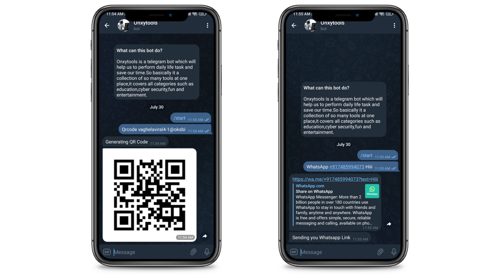

# Onxytools - A collection of all useful tools in one Single Telegram Bot

[Checkout this on Telegram](https://t.me/onxytoolsbot)


**Features:**
1) General Use

- [✅] wallpaper based on search query
- [✅] QR Code generator
- [✅] whatsapp msg sender without saving number

2) Entertainment & Fun
- [✅] Jokes
- [✅] Memes
- [✅] Quotes

3) Security tools
- [✅] Domain Whois information finder
- [✅] ping
- [✅] user recon
- [✅] Instagram Recon




## How to Setup?
Clone the repository from [GitHub](https://github.com/viralvaghela/onxytools)
```bash
git clone https://github.com/viralvaghela/onxytools
```
Change the directory to the directory where you cloned the repository
```bash
cd onxytools
```
Install the dependencies
```javascript
npm install
```
Add your API ket in utilis/utils.js

Run the project
```bash
npm start
```

